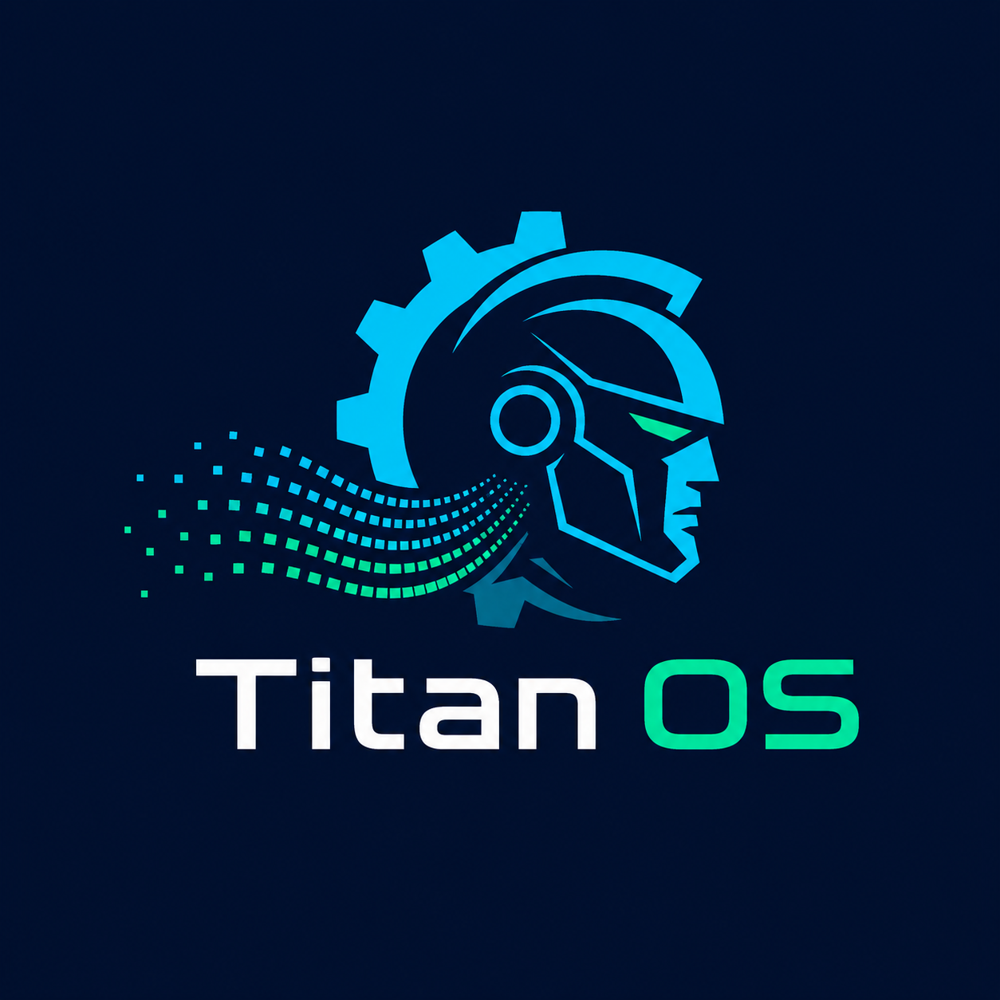

#  Titan OS: Industrial Edge Telemetry & Predictive AI
   [](https://github.com/i-akb25/Titan-Edge-Telemetry)
<br>


Titan OS is a containerized, closed-loop industrial IoT architecture. It simulates a heavy-machinery manufacturing environment (like steel extrusion or induction furnaces), processes high-frequency edge sensor data, and visualizes machine health in real-time.

The core objective of this platform is **Predictive Maintenance**. By analyzing fluctuating mechanical profiles (temperature and chassis vibration), the system dynamically calculates the **Time-To-Failure (TTF)** and automatically triggers critical fault protocols before catastrophic breakdowns occur.

---

## 🧠 System Architecture & Hybrid Client

This project is built using a **Hybrid Edge-Client Architecture** to guarantee 100% dashboard uptime, even if the backend cloud servers are put to sleep to conserve resources.

### 1. Secure Cloud Live Mode (Full Stack)
When deployed locally via Docker, the system runs as a full edge-to-cloud pipeline:
* **Edge Node (Python):** A hardware simulation script that generates randomized, sine-wave-based mechanical and electrical profiles for heavy machinery.
* **Ingestion Gateway (Node.js/Express):** Receives Python payloads, broadcasts them to the UI via **WebSockets** with sub-second latency, and securely logs the electrical matrix to the cloud.
* **Data Warehouse (Aiven MySQL):** A strictly structured cloud database logging full telemetry history (Voltage, Current, Power Consumption, Temp, Vib, Faults).

### 2. Local Demo Simulation (Browser Fallback)
If the React UI detects that the Node.js backend is offline (e.g., sleeping on a free-tier hosting provider), it gracefully degrades into a "Smart Client." 
* It completely bypasses the network.
* It spins up a localized JavaScript physics engine directly in the user's browser.
* It generates the exact same visual waveforms, alert logs, and TTF degradation, allowing recruiters and users to test the dashboard with zero setup.

---

## ⚙️ Key Features

* **Real-Time Data Visualization:** Smooth, non-blocking telemetry charts powered by `Recharts`.
* **Predictive TTF Engine:** Dynamic Time-To-Failure algorithms that penalize machine life heavily based on high-temperature or high-vibration thresholds.
* **Automated Fault Logging:** Tracks specific machine failures (e.g., `Heavy-Extruder-A: ERR-TEMP-HIGH`) in a chronologically sorted alert ledger.
* **Instant Database Purge:** A secure command to instantly truncate the live MySQL database and wipe the frontend state clean.
* **Offline CSV Export:** Single-click extraction of the current active session's telemetry data for external ML training or offline data analysis.
* **Docker Orchestration:** One-command deployment using `docker-compose` to spin up the isolated Node.js server and Python edge-node synchronously.

---

## 📊 Data Pipeline, BI & Machine Learning

Beyond real-time streaming, Titan OS is equipped with a robust historical data pipeline designed for long-term plant analytics, business intelligence, and advanced predictive modeling.

* **Relational Architecture (`init.sql`):** The system relies on a containerized MySQL 8.0 database, automatically provisioned with optimized schemas for high-throughput, time-series machine data.
* **Batch Ingestion (`load_to_mysql.py`):** A dedicated Python ETL script designed to parse, clean, and load massive CSV telemetry logs directly into the relational database.
* **Business Intelligence (`Telemetry.pbix`):** Includes a complete Microsoft Power BI dashboard for historical trend analysis. This allows plant managers to visualize long-term thermal degradation and cross-reference vibration anomalies across different operational shifts.
* **Predictive ML Expansion:** The database is configured to silently capture the mechanical variables shown on the UI, alongside hidden electrical variables (voltage, current, power_consumption_kw). This structured dataset is primed for exporting to Jupyter Notebooks to train Random Forest or XGBoost models for advanced anomaly detection.
---

## 🏗️ System Architecture

* **Frontend:** React.js, Vite, Recharts (Dual-axis rendering)
* **Backend:** Node.js, Express, WebSockets (`server.js`)
* **Edge ML / Simulator:** Python, Pandas, NumPy (`telemetry_simulator.py`, `live_telemetry.py`)
* **Database / ETL:** MySQL 8.0 (Aiven Cloud), Python Connector
* **DevOps:** Docker, Docker Compose
* **Business Intelligence:** Microsoft Power BI

---

## ⚙️ Quick Start Installation

### Prerequisites
* Docker & Docker Desktop
* Node.js (v18+)
* Python (3.10+)

**1. Clone the repository**
```bash
git clone https://github.com/i-akb25/Titan-Edge-Telemetry.git
cd Titan-Edge-Telemetry

```

**2. Environment Setup**
*Create a .env file in the root directory and add your MySQL database credentials:*
```bash
DATABASE_URL=mysql://[user]:[password]@[host]:[port]/[database]?ssl-mode=REQUIRED
PORT=5000

```

**3. Boot the IIoT Infrastructure (Backend & Database)**
*Docker handles the MySQL database and backend networking automatically.*

```bash
docker-compose up -build

```

*The API will be available on `http://localhost:5000` and the MySQL database on port `3309`.*

**4. Setup the Python Edge Environment**

```bash
python -m venv .venv
# Windows:
.venv\Scripts\activate
# Linux/Mac:
source .venv/bin/activate

pip install pandas numpy mysql-connector-python

```

**5. Start the Frontend Dashboard**

```bash
cd titan-web
npm install
npm run dev

```

**6. Run the Plant**
Open `http://localhost:5173` in your browser and click **Start Plant** to initialize the background Python daemon and open the WebSocket telemetry stream.

---

## 📸 Interface Preview


--- 

## 🤝 Contributing
Contributions are welcome! 🖍️  
- Fork this repository.  
- Create a new branch for your feature or bug fix.  
- Submit a pull request with a clear explanation of your changes.  

Let’s make this command centre even more awesome! 🚀
---
##🙏 Acknowledgements & Tech Stack

This project was made possible by several incredible open-source tools:
- React.js - Smart Client UI
- Recharts - Real-time Data Visualization
- Express.js & Node.js - High-throughput Edge Gateway
- Aiven MySQL - Secure Cloud Data Warehousing
- Docker - Containerization & Microservices Orchestration
---
## 📜 License

This project is licensed under the MIT License.

---

## 📬 Developer Info

**Anurag Aryan | Electrical Engineer & Full-Stack Developer**
For inquiries or collaboration, feel free to reach out:  
* **GitHub:** [@i-akb25](https://www.google.com/search?q=https://github.com/i-akb25)
📩 **Email**: [anuragaryanofficial@gmail.com](mailto:anuragaryanofficial@gmail.com)

---

Made with ❤️ by **Anurag Aryan** ✨
*If you are a recruiter or engineering manager, feel free to reach out to discuss this architecture, my data modeling process, or potential opportunities.*
*Built to explore the intersection of full-stack web technologies, embedded edge systems, and heavy industrial automation.*

